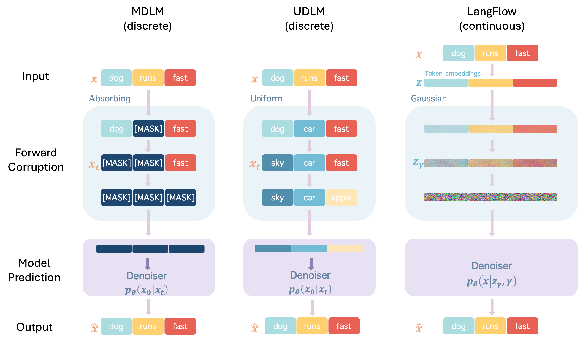
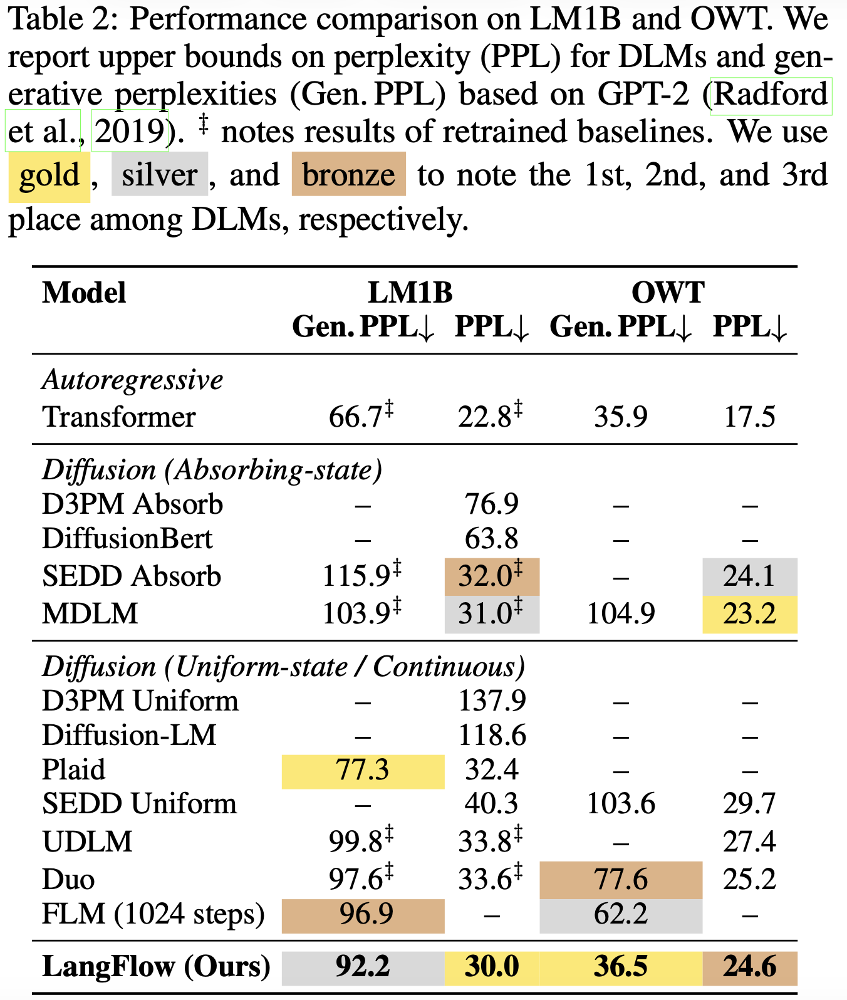

<div align="center">

# LangFlow: Continuous Diffusion Rivals Discrete in Language Modeling

</div>

[](https://arxiv.org/abs/2604.11748) [](https://huggingface.co/Continuous-Rivals-Discrete/langflow-owt) [](https://caradryanl.github.io/blog/2026/langflow/)

By Yuxin Chen*, Chumeng Liang*, Hangke Sui*, Ruihan Guo, Chaoran Cheng, Jiaxuan You, Ge Liu.

**The first continuous diffusion language model that rivals discrete counterparts on standard language modeling benchmarks like LM1B and OpenWebText**.

<div align="center">
  
  
</div>

## TODO

- [x] Inference code
- [x] OpenWebText checkpoint on [HuggingFace](https://huggingface.co/Continuous-Rivals-Discrete/langflow-owt)
- [ ] Training code (after paper acceptance)  
- [ ] All trainable checkpoints (after paper acceptance)

## Quick Start

### 1. Install dependencies

```bash
conda create -n langflow python=3.12
conda activate langflow
# Install CUDA-enabled torch first (adjust cu124 to match your driver)
pip install torch --index-url https://download.pytorch.org/whl/cu124
pip install -r requirements.txt
```

### 2. Download the checkpoint

Download only the safetensors weights file from HuggingFace — no need to clone the HF repo:

```bash
# Using huggingface-hub CLI
hf download Continuous-Rivals-Discrete/langflow-owt model.safetensors --local-dir ./checkpoints
```

### 3. Run inference

```bash
python inference.py \
    --checkpoint ./checkpoints/model.safetensors \
    --num_samples 5 \
    --batch_size 1 \
    --num_steps 1024 \
    --seq_length 1024 \
    --seed 42 \
    --output samples.txt
```

## Citation

```
@article{chen2026langflow,
  title={LangFlow: Continuous Diffusion Rivals Discrete in Language Modeling},
  author={Chen, Yuxin and Liang, Chumeng and Sui, Hangke and Guo, Ruihan and Cheng, Chaoran and You, Jiaxuan and Liu, Ge},
  journal={arXiv preprint arXiv:2604.11748},
  year={2026}
}
```
